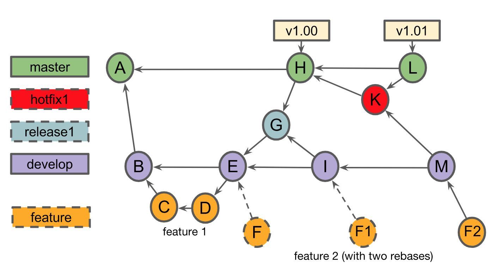

# Version Control with Git Course: Final Project

## Table of Contents

- [About](#about)
- [Getting Started](#getting_started)
- [Usage](#usage)

## About 

This project corresponds to the final project of the course "Version Control with Git", from Coursera.

The project consisted of creating a repository which commit history corresponds to the following diagram

The details are available in [Version-Control-with-Git-Final-Project.pdf](./Version-Control-with-Git-Final-Project.pdf).

## Getting Started 

These instructions will get you a copy of the project up and running on your local machine for development and testing purposes.

### Prerequisites

Only `git` is required, although a GUI tool may come handy for watching the commit history and branches.
